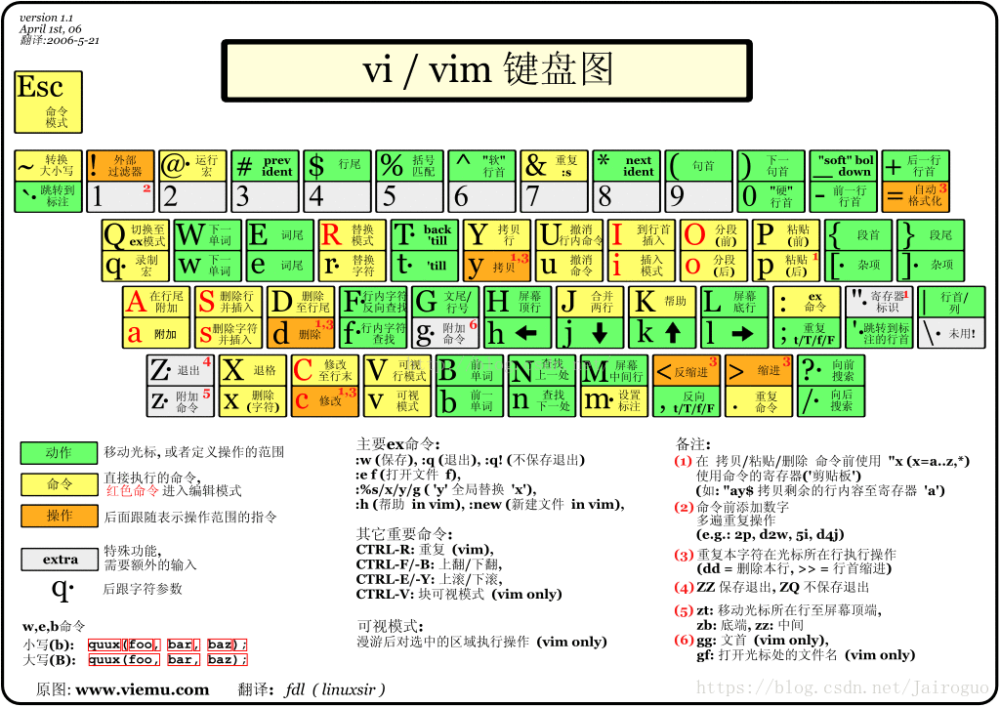

# 《vim 使用笔记》
## chapter0-简介
* 三种模式
    * 命令模式（Command mode）
    * 输入模式（Insert mode）
    * 底线命令模式（Last line mode）
* 每个模式之间的切换
> 命令模式 -> 输入模式 : 输入 i a o 
> 输入模式 -> 命令模式 : esc键
> 命令模式 -> 底线命令模式 :  冒号
> 底线命令模式 -> 命令模式 : 命令以 enter 结束运行

* 操作实例
> 定位到一个单次， yaw(yank all word 复制整个单词) 复制一个单词，p粘贴
> y4j ：复制了包括当前行在内的下4行的内容，一共5行

### vim 键盘图

## chapter1-输入模式
> i 从当前光标的前一个字母开始输入
a  (append) 从当前光标之后开始输入
I  从这一个行的开头进入输入模式
A  从这一个行的末尾进入输入模式
cc  删除当前行，然后进入INSERT MODE

## chapter2-普通模式的相关操作
### 命令解释
> i : input
y : yank
u : undo
c : change

### 方向定位
> 方向键  h(←)  j(↓)  k(↑)  l(→) 

## 删除
> x        删除当前光标下的字符
dw       删除光标之后的单词剩余部分。
d$       删除光标之后的该行剩余部分。
dd       删除当前行。
c        功能和d相同，区别在于完成删除操作后进入INSERT MODE
dj       删除当前行和下一行的内容
d5j       删除当前行和下5行的内容

## 复制 + 粘贴

===================        复制/粘贴      ==========================================
1. 选定文本块。使用v进入可视模式，移动光标键选定内容。

2.复制的命令是y，即yank（提起） ，常用的命令如下：
    y      在使用v模式选定了某一块的时候，复制选定块到缓冲区用；
    yy    复制整行（nyy或者yny ，复制n行，n为数字）；
    y^   复制当前到行头的内容；
    y$    复制当前到行尾的内容；
    yw   复制一个word （nyw或者ynw，复制n个word，n为数字）；
    yG    复制至档尾（nyG或者ynG，复制到第n行，例如1yG或者y1G，复制到档尾）

3. 剪切的命令是d，即delete，d与y命令基本类似，所以两个命令用法一样，包括含有数字的用法.
    d      剪切选定块到缓冲区；
    dd    剪切整行
    d^    剪切至行首
    d$     剪切至行尾
    dw    剪切一个word
    dG     剪切至档尾

4. 粘贴的命令式p，即put（放下）
    p      小写p代表贴至游标后（下），因为游标是在具体字符的位置上，所以实际是在该字符的后面
    P      大写P代表贴至游标前（上）
    整行的复制粘贴在游标的上（下）一行，非整行的复制则是粘贴在游标的前（后）

set nu    显示行号
gg     跳转到文件开头
/     向后搜索
?    向前搜索
n    查找下一处
N    查找上一处
|     光标所在行行首
L    屏幕所显示的底行
{    段首
}    段尾
-    前一行行首
+    后一行行首
(    句首
)    下一句首
$    行末
M    屏幕中间行
   行首（零）
hjkl    左下上右
x    删除光标所在字符
R    替换模式（可以替换任意字符）
r    单个替换
dd     删除光标所在的行
D    删除至行末（从光标位置开始）
s    删除字符并插入（单个字符删除，并进入插入模式）
S    删除行并插入（整行删除）
>>     缩进（相当于一个tab）
<<     反缩进
=    自动格式化
J    合并上下两行
I    插入到行首
i     插入
C    从光标处开始修改至行位
a    在光标后附件或追加
A    在行末追加
p    粘贴（后）
P    粘贴（前）
Esc     命令模式
ZZ     保存退出编辑(vi，含保存)
ZQ    不保存退出编辑

### 保存
* 按ESC键 跳到命令模式，然后：

> :w 保存文件但不退出vi
:w file 将修改另外保存到file中，不退出vi
:w! 强制保存，不推出vi
:wq 保存文件并退出vi
:wq! 强制保存文件，并退出vi
q: 不保存文件，退出vi
:q! 不保存文件，强制退出vi
:e! 放弃所有修改，从上次保存文件开始再编辑

## chapter3 可视模式
* 普通模式 按 v 进入可视模式，主要用来选中一段内容
> 通过移动光标，选中内容，y 复制内容， d 删除内容， c 是删除并进入命令模式，

## chapter4 参考资料
* https://www.bilibili.com/video/BV1UQ4y1z7q5?spm_id_from=333.337.search-card.all.click

* IDE 安装 vim 插件

* neovim

### 辅助练习游戏
> 强烈推荐这个小游戏Vim大冒险来学习vim！
https://vim-adventures.com/
我的配置文件看这里：
https://github.com/MarsWang42/My-Vim-Conf
VimAwesome网站： 当前流行的 vim 插件
https://vimawesome.com/
Vim Plug Github页面：
https://github.com/junegunn/vim-plug

