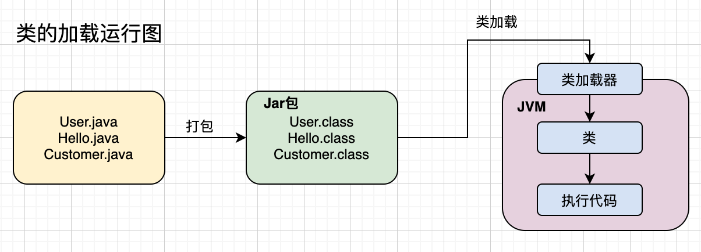
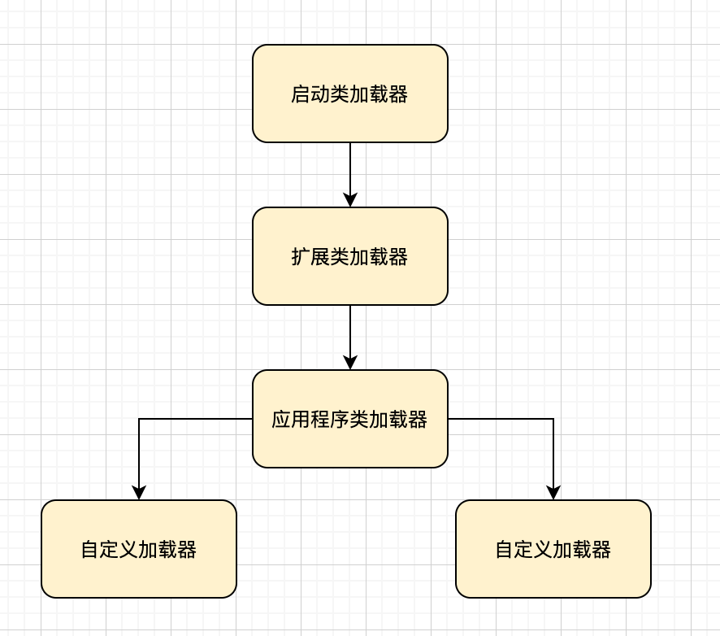

# 从0开始带你成为JVM实战高手

## chapter2 一探究竟：我们写的Java代码到底是如何运行起来的？
* JVM 基于自己字节码执行引擎，执行加载到内存的类，比如代码中有 main 方法，就会从 main() 方法中开始执行，遇到需要执行的类，就加载到虚拟机。

## chapter03 面试官对于 JVM 类加载机制的猛烈炮火，你能顶住吗？
* jvm在什么情况下会加载一个类？
    * 在代码中用到这个类的时候
    * 加载到使用的过程：加载 -> 验证 -> 准备 -> 解析 -> 初始化 -> 使用 -> 卸载
    * 验证阶段：根据java虚拟机的规范，校验加载进来的.class文件的内容，是否符合虚拟机的规范，以防class文件被人修改过了
    * 准备阶段：给java类分配内容空间，给类里面的变量分配空间，给定默认的初始值
    * 解析阶段：将符号引用替换为直接引用的过程，具体的内容比较复杂，涉及到 jvm 的底层
    * 初始化阶段：准备阶段只是给类变量（比如 flushInterval）一个默认的初始值0，但是真正赋值语句的执行，是在初始化阶段完成
        * 类的初始化规则：
            * new ReplicaManager()，会出发类的加载和初始化全过程
            * 包含 main() 方法的类，会立即初始化
            * 如果初始化时，发现父类没有初始化，则立马初始化父类
* 类加载器和双亲委派机制
    * 类加载器
        * 启动类加载器：Bootstrap ClassLoader，主要负责加载我们在机器上安装的Java目录下的核心类的（Java安装目录下的“lib”目录中的核心类库）
        * 扩展类加载器：Extension ClassLoader，加载Java安装目录下的“lib\ext”
        * 应用程序类加载器 Application ClassLoader 加载“ClassPath”环境变量所指定的路径中的类，大致理解为加载你写好的Java代码，
           这个类加载器就负责加载你写好的那些类到内存里
        * 自定义类加载器 
            * JVM的类加载器是有亲子层级结构的，就是说启动类加载器是最上层的，扩展类加载器在第二层，第三层是应用程序类加载器，最后一层是自定义类加载器。
            * 双亲委派机制： 
                 
                * 假设你的应用程序类加载器需要加载一个类，他首先会委派给自己的父类加载器去加载，最终传导到顶层的类加载器去加载
                    但是如果父类加载器在自己负责加载的范围内，没找到这个类，那么就会下推加载权利给自己的子类加载器    
                * 可以避免多层级的加载器结构重复加载某些类
                 
## chapter04 JVM中有哪些内存区域，分别都是用来干嘛的？
* JVM 内存区域划分
    * MetaSpace元数据空间（1.8以前为方法区）主要存放 类的相关信息，常量池等
    * 程序计数器：记录当前执行的字节码指令的位置，每个线程都会有一个程序计数器，记录线程目前执行到哪一条字节码指令
    * 虚拟机栈：保存方法内的局部变量等数据，每一个方法调用对应一个栈帧
    * 堆内存：存放代码中创建的各种对象
    * 其他内存区域：native方法（线程对应的本地方法栈等）
* tomcat 的类加载机制设置
    * 打破了双亲委派机制，每个WebApp负责加载自己对应的那部分web应用的class文件，不会传导到上层的加载器去加载

## chapter05 JVM的垃圾回收机制是用来干嘛的？为什么要垃圾回收？
* 我们创建的那些对象，到底在Java堆内存里会占用多少内存空间呢？
    * 一个对象对内存空间的占用，大致分为两块
        * 一个是对象自己本身的一些信息
        * 一个是对象的实例变量作为数据占用的空间(比如对象头，如果在64位的linux操作系统上，会占用16字节，然后如果你的实例对象内部有个int类型的
        实例变量，他会占用4个字节，如果是long类型的实例变量，会占用8个字节。如果是数组、Map之类的，那么就会占用更多的内存了。) 
            另外JVM对这块有很多优化的地方，比如补齐机制、指针压缩机制，比较复杂，不会详细梳理 

## chapter08 聊聊JVM分代模型：年轻代、老年代、永久代
