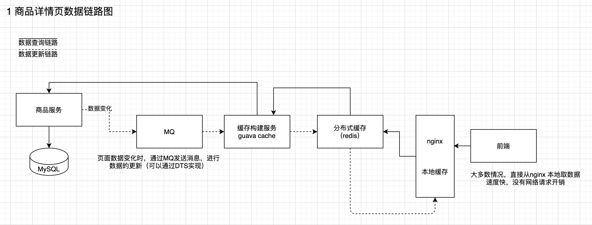

# 基于大型电商网站中的商品详情页系统

## chapter02
* 商品详情页系统架构 -> 缓存架构 -> 高并发技术 + 解决方案 + 架构 -> 高可用技术 + 解决方案 + 架构

## chapter03 小型电商网站的商品详情页的页面静态化架构以及其缺陷
* 小型网站的页面数据变化，可以全部重新查数据渲染，但是如果页面太多，就会有很多性能问题

## chapter04 大型电商网站的异步多级缓存构建+nginx数据本地化动态渲染的架构
* 常见的架构图



## chapter05 能够支撑高并发+高可用+海量数据+备份恢复的redis的重要性
* 支持整个缓存体系的架构，其实就是 redis 的架构，是否能够支持几十万 QPS 的访问量，99.99%的可用性，TB级别的数据，备份和恢复等。

## chapter06 虚拟机中安装 centos 集群
* 未看

## chapter07 redis 单机版的生产环境安装方案


## chapter08 redis持久化机对于生产环境中的灾难恢复的意义
* 持久化的意义主要是故障恢复，内存中的数据重启之后就丢失了
* redis 内存中的数据存到磁盘中，同时将数据同步备份到云端存储（比如阿里云、亚马逊）

## chapter09 redis的RDB和AOF两种持久化机制的工作原理

## chapter10 redis的RDB和AOF两种持久化机制的优劣势对比


## chapter13 在项目中部署redis企业级数据备份方案以及各种踩坑的数据恢复容灾演练
* 数据备份的方案
    * crontab 定时调度脚本去做数据备份
    * 每天 copy 一个 rdb 的备份，到一个目录中
* 没看完，感觉是偏DBA 运维的知识多一些

## chapter14 redis如何通过读写分离来承载读请求QPS超过10万+
* redis 单机能够承载的QPS 在 1-10W不等，根据业务以及操作命令的复杂性不同，实际QPS 会有变化
* 如果要支持10W+的并发
    * redis集群做读写分离，因为缓存一般是用来支撑读高并发的，做成主从架构，一主多从，主负责写，并将数据同步到其他slave节点，从节点负责读，所有的读请求全部都走slave节点
    * redis slave 是可以水平扩容的，随着读 QPS 的增加，通过增加 slave 的数量就可以实现，前提是内存不显著增加
    
## chapter15 redis replication以及master持久化对主从架构的安全意义
* redis replication 的核心机制
    * 写入数据时，直接写入 master，master立即返回成功，然后异步将数据复制到 slave 机器中。
    * 一个 master 节点可以有多个 slave 节点，一个 slave 节点可以连接其他的 slave 节点
    * slave node 做复制时，不会 block master 节点的操作的，同样也不会 block 自己本身的查询操作，临时用旧数据提供服务，但是新数据同步完成之后，删除旧的，加载新的，会停止对外部的服务
    * slave node 主要用来做横向扩容，读写分离，提高系统的读 QPS 
* 主从架构时，master的数据必须做持久化。因为如果不持久化，master宕机之后重启，数据就是空的，那么slave节点的数据也会被清空，100%数据丢失。
    * master的数据要注意备份，万一本地数据丢失，会出问题

## chapter16 redis主从复制原理、断点续传、无磁盘化复制、过期key处理
* redis主从复制原理（描述+示意图）
    * 启动 slave node 时，会发送 psync 命令给 master node。
        * 如果是 slave node 重连 master node，那么 master 仅会复制给 slave 缺少的数据
        * 如果是slave 第一次连接 master，会出发 full resyncchronization， master启动一个后台进程，开始生成一份 RDB 文件，同时将从客户端收到的所有写命令
        缓存在内存中，RDB 文件生成完毕之后 master 发给 salve。slave会先写入本地磁盘，然后再加载到内存中，然后 master 将缓存的命令刚发给 slave，slave 同步这些命令。
* 主从复制断点续传
    * master slave 都会保存一份 replica offset，如果复制过程中网络断掉了，slave 会让master从上次的replica offset 进行复制。
* 无磁盘化复制
    * master在内存中创建RDB，发送给slave，不在本地落盘
* 过期key处理
    * slave不会主动过期key，只会等待master过期key，如果master过期了一个key，会模拟一个del命令发送给slave
 

## chapter17 redis replication的完整流运行程和原理的再次深入剖析
* 主要是复制过程中的一些细节问题
* 全量复制和增量复制、主从节点之间10s互相发送心跳

## chapter18 在项目中部署redis的读写分离架构（包含节点间认证口令）
* 虚拟机上的部署实践

## chapter19 对项目的主从redis架构进行QPS压测以及水平扩容支撑更高QPS
* redis 本身提供的 redis-benchmark 进行测试方便快捷
* 一般来说，redis服务器支撑上W的QPS没问题，具体支持多高，跟机器配置、命令复杂度、数据量大小都有关系，没有一个统一的标准。

## chapter20 redis主从架构下如何才能做到99.99%的高可用性？
* 99.99%的高可用性
    * 在 master 故障时，自动检测，将某个 salve node 自动切换为 master node 的过程，叫做故障转移，主备切换

## chapter21 redis哨兵架构的相关基础知识的讲解
* 哨兵的主要功能
    * 集群监控 负责监控 master 和 slave 节点是否正常工作
    * 消息通知 如果某个 redis 实例有故障，哨兵负责发送消息作为报警给管理员
    * 故障转移 如果 master 节点挂了，会自动转移到 slave 节点上面
    * 配置中心 如果故障转移发生了，通知client新的 master 地址
* 哨兵本身也是分布式的，作为一个集群去运行，互相协同工作
    * 故障转移时，判断一个 master node 宕机需要大部分哨兵都同意才行，涉及到了分布式选举的问题
    * 哨兵至少需要3台机器来保证高可用性，哨兵+redis主从的部署架构，是不能够保证数据零丢失的，只能保证 redis 集群的高可用
* 经典的部署架构
    * 3节点哨兵集群

## chapter22 redis哨兵主备切换的数据丢失问题：异步复制、集群脑裂
* 异步复制
    * master node 还没来得及给 slave node 同步完最新的数据，就宕机了，slave node 成了新的 master node，造成数据丢失
    * 减少损失方案： min-slaves-max-lag 参数配置，如果slave 数据延迟的数据太多，那么就认为 master 宕机之后的损失太多，就会拒绝写请求，
        将主从切换导致的数据损失保持在一个可控的范围内
* 集群脑裂
    * master 节点更替的时候，原来的 slave 节点成为 master 节点，可能会导致脑裂问题
    * 减少损失方案：与异步复制相同，

## chapter23 redis哨兵的多个核心底层原理的深入解析（包含slave选举算法）
* 宕机
    * sdown 主观宕机： 一个哨兵认为master宕机
    * odwon 客观宕机：quorum 数量的哨兵认为 master 宕机
* 哨兵之间的互相发现，是通过redis 的pub/sub 通道进行的，上传自己的心跳信息，与其他哨兵交换master的配置，进行配置信息的同步
* slave 配置的自动纠正，比如连接新的 master 节点
* slave -> master 的选举算法，优先级由高到低考虑以下几个因素
    * 跟 master 连接的时长
    * slave 的优先级
    * offset 大小
    * run id 

## chapter24 在项目中以经典的3节点方式部署哨兵集群
* 可以通过一套哨兵集群来监控多个主从架构，具体的配置参数没有记录

## chapter25 对项目中的哨兵节点进行管理以及高可用redis集群的容灾演练


## chapter26 redis如何在保持读写分离+高可用的架构下，还能横向扩容支撑1T+海量数据
* 通过 redis-cluster, 横向扩容，部署多台 master 机器。支持 n 个 master node， 每个 master node 挂载 n 个 slave node（多master+读写分离+高可用）
* redis cluster 主要是针对海量数据 + 高并发 + 高可用，如果数据量小，可以自己搭建哨兵集群，保证redis主从架构的高可用性。
* 

## chapter27 数据分布算法：hash + 一致性hash + redis cluster的hash slot
* 一般的取模 hash 算法：缺点较多，一般不适用
  * 一旦一个master宕机，机器的数目发生了变化，则所有的数据计算分片都会发生问题，大部分的缓存失效，流量打到数据库中。
* 一致性hash：key落在圆环上，顺时针寻找距离自己最近的节点，
  * 一个节点宕机时，只会影响到一个master上面的数据，不会影响到其他节点的数据
  * 可能存在缓存热点，在某个区间内的数据比较多，导致某一个节点的压力过大：通过虚拟节点解决数据负载均衡的问题


## chapter28 在项目中重新搭建一套读写分离+高可用+多master的redis cluster集群
* 主要讲了如果操作集群的部署问题

## chapter29 对项目的redis cluster实验多master写入、读写分离、高可用性
* 


## chapter32 redis cluster的核心原理分析：gossip通信、jedis smart定
* Gossip 协议（P2P 网络核心技术）
  * Redis Cluster采用P2P的Gossip协议进行通信，节点之间不断的交换信息，这些信息包括节点负责哪些slot、是否出现故障等信息
    集群中的每个节点都会单独开通一个TCP通道，用于节点之间彼此通信，通信端口号为基础端口号+10000，例如10.0.0.100:6379的通信端口号为16379
    每个节点在固定周期内通过特定规则选择几个节点发送ping消息
    接收到ping消息的节点用pong消息作为响应
    集群中的每个节点通过一定的规则挑选要通信的节点，每个节点可能知道其他全部节点，也可能仅知道部分节点，只要这些节点之间可以正常通信，最终它们会达到一致状态，当节点出现故障、新节点加入、 
    主从角色变化、slot信息变更等事件发生时，通过不断的ping/pong消息通信，经过一段时间后所有的节点都会知道整个集群全部节点的最新状态，从而达到集群状态同步的目的。
  * 链接：https://www.jianshu.com/p/2998c70e2976
  * gossip 协议与集中式的元数据存储方式不同，将元数据存储在多个节点上
  * gossip的几种消息： ping pong meet 

* jedis 客户端
  * smart jedis ： 基于重定向的客户端，消耗网络的IO，可能出现请求重定向，才会找到合适的redis节点

  
## chapter33 redis在实践中的一些常见问题以及优化思路（包含linux内核参数优化）
* fork() 子进程造成的卡顿问题
  * redis每个节点的内存会对数据持久化的时间有影响，AOF RDB 的过程中，如果停顿的时间过长，可以通过减少redis节点的内存大小来减少停顿的时间。
* 最大文件打开句柄
  * ulimit -n 10032


## chapter34 redis阶段性总结：1T以上海量数据+10万以上QPS高并发+99.99%高可用

## chapter35 亿级流量商品详情页的多级缓存架构以及架构中每一层的意义
* 主要是三级缓存: nginx本地缓存  + redis分布式缓存 + tomcat 堆缓存
* 业务分析
  * 时效性要求高的数据：比如商品价格、库存等，相关服务每次发生变更的时候，缓存+数据库双写的策略，保证缓存的时效性最高
  * 时效性要求不高的数据：比如商品的名称、规格参数、颜色、版本等，可以采用异步更新的方式，比如通过MQ进行通知，可以通过数据生产的服务进行缓存的更新
* 方案实现以及每一层的意义
  * 第一层缓存：nginx + lua 脚本，部署到 nginx 本地，做第一层业务逻辑，优先从 nginx 本地缓存中取出各种数据，从而生成所需要的页面。如果在本地没有发现缓存，则从 redis 中拉取缓存，更新到 nginx 本地。
  * 第二层缓存：redis分布式缓存。因为nginx的内存优先，redis负责提供大量的离散数据。
  * 第三层缓存：tomcat 的堆内缓存。如果redis 没有命中，则从堆内存中进行查询，防止redis灾难，流量直接打到数据库。


## chapter36 Cache Aside Pattern 缓存+数据库读写模式的分析
* 最经典的数据库+缓存读写模式
  * cache aside pattern 
    * 读：先读缓存，如果没有命中，则读数据库，从数据库中取出数据更新缓存
    * 写：更新数据库，再删除缓存。
    * 为什么是删除缓存而不是更新缓存？因为更新缓存的代价高，缓存可能是查询了多个数据源，然后经过计算出来的，如果频繁的更新，不能保证每次更新都能够被访问到。
      删除缓存，是一个 lazy的思想，不需要每次都做复杂的计算，而是保证在使用的时候才会进行计算。
  * 

## chapter37 高并发场景下的缓存+数据库双写不一致问题分析与解决方案设计(1)
* cache aside pattern 如果数据库更新成功，但缓存删除失败，导致缓存是脏的，如何解决？
  * 方案一：可以再更新数据库之前，给缓存一个过期时间，如果更新数据库成功，删除缓存失败，那么缓存也会很快失效
  * 方案二（最初级的解决方案）：先删除缓存，再更新数据库。
  * 方案二仍然会存在数据不一致的情况：更新数据库时，当还没有更新成功数据。此时有一个线程读取缓存，从数据库中读取出旧数据，更新到缓存。
    * 如果一定要解决不一致的问题，可以根据访问的业务对象进行路由，进入到不同的队列中，每个请求在队列中有序，人工排序一下，就可以保证顺序性，但是后续的请求会被前面的请求阻碍一段时间，RT会增加一些

## chapter38 在linux虚拟机中安装部署MySQL数据库
* 跟课程主题无关

## chapter40 代码实践：在库存服务中实现缓存与数据库双写一致性保障方案（一）
* 代码执行逻辑
  * web 应用初始化时，监听 servelet 的启动事件
  * 建立线程池，给线程池的每一个线程分配一个内存队列，写成单例模式，在应用启动的时候初始化
  * 
* TODO 单例线程池的代码实现
* 代码实现
  * 实现 ServletContextListener 能够监听 ServletContext 对象的生命周期，实际上就是监听 Web 应用的生命周期。 当Servlet 容器启动或终止Web 应用时，会触发ServletContextEvent 事件，该事件由ServletContextListener 来处理。

```java

```


