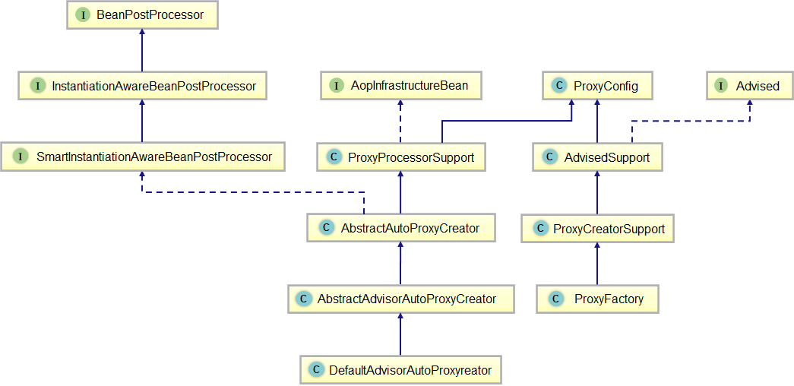

## 基本概念
* advisor = pointcut(切点) + advice（通知）
* 增强的方式
    * 前置
    * 后置
    * 环绕
    * 异常
    * 引入（可以为一个没有实现某一个接口或者功能的类添加新的功能）

引入增强的意思即假如项目中一个Java类没有实现某个接口而不具备某些功能，这个时候我们可以使用引入增强（Introduction Advice）在不修改这个类的前提下，
使该类具备某个接口的功能。

## 基本流程
* 解析和注册
* 创建代理类
* 执行调用链


## AOP的织入方式
* 编译期织入，要求使用特殊的java编译器
    * aspectJ
* 类装载期织入，要求使用特殊的类装载器
    * aspectJ
* 动态代理织入，在运行期为目标类添加增强生成子类
    * spring
        * JDK 本身只提供接口的代理  创建时间短，但是性能低
        * CGLib 可以提供类的代理，动态创建子类，不能对 final 和 private 方法进行代理，创建时间长，但是性能好，适合单例模式   


Spring AOP 有很多相关类，如：ProxyFactory、ProxyCreatorSupport、AdvisedSupport、ProxyConfig。而Spring AOP其中核心类则是 
ProxyCreatorSupport，此类主要功能是初始化具体的动态代理。而 AdvisedSupport、ProxyConfig 的主要是围绕 AOP 相关配置进行封装。



## 核心类的源码注释

### ProxyConfig

```java
public class ProxyConfig implements Serializable {

	/** use serialVersionUID from Spring 1.2 for interoperability. */
	private static final long serialVersionUID = -8409359707199703185L;

    // 通过接口进行代理还是通过类进行代理 （JDK 或者 CGLIB）
	private boolean proxyTargetClass = false;

	private boolean optimize = false;

    // 是否阻止配置的代理对象转换为 Advised 类型
	boolean opaque = false;

    // 是否允许将代理对象以 ThreadLocal 的方式暴露出去
	boolean exposeProxy = false;

    // 代理对象生成之后能够再对代理对象进行修改
	private boolean frozen = false;
}
```

## 主要类的作用
AopInfrastructureBean	标记接口。用来表明该Bean是Spring AOP基础类。这意味着即使切点匹配，任何此类Bean都不会被自动代理。
Avised	AOP代理工厂配置类接口。此配置包括Interceptor、Advice、Advisor和代理接口。 从Spring获得的任何AOP代理都可以转换为该接口，以便进行相关Aop操作。
AvisedSupport	AOP代理配置管理类。该类可以配置当前代理的Adivsiors、目标对象、代理的接口，以及获取对应代理方法对应有效的拦截器链。本类本身不提供创建代理的方法，而用于生成拦截器链和保存代理快照。
ProxyConfig	用于创建代理的配置类，以确保所有代理创建者具有一致的属性。该类主要为AOP代理对象工厂实现类提供基本的配置属性
ProxyProcessSupport	代理处理器常用功能的基类
AbstractAutoProxyCreator	自动代理创建器的抽象实现。该类的作用是使用AOP代理包装每个合格的Bean，并在调用Bean之前委派指定的拦截器。
AbstractAdvisorAutoProxyCreator	通用自动代理创建器。根据检测到的每个Advisor为特定的Bean构建AOP代理。
DefaultAdvisorAutoProxyCreator	基于当前BeanFactory中的所有候选 Advisor 来创建AOP代理。换句话来说，该类的作用就是扫描上下文找出所有Advisor，并将这些Advisor应用到所有符合切入点的Bean中。
ProxyCreatorSupport	代理工厂的基类。提供对可配置AopProxyFactory的便捷访问，如：注册和触发监听器、创建AopProxy等
ProxyFactory	AOP代理工厂（以编程方式使用，而不是通过声明式使用）


