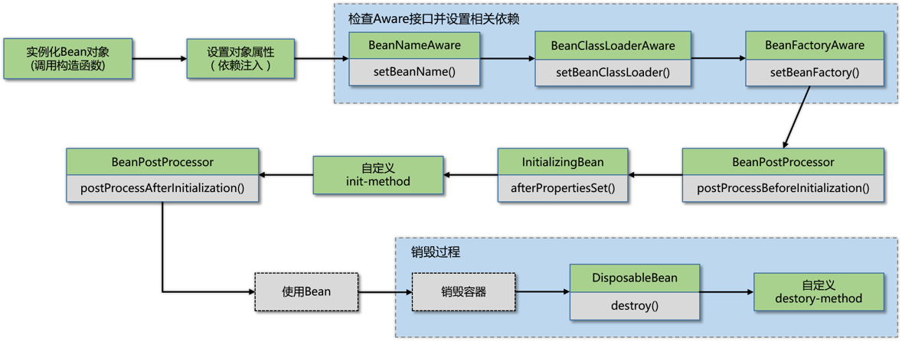
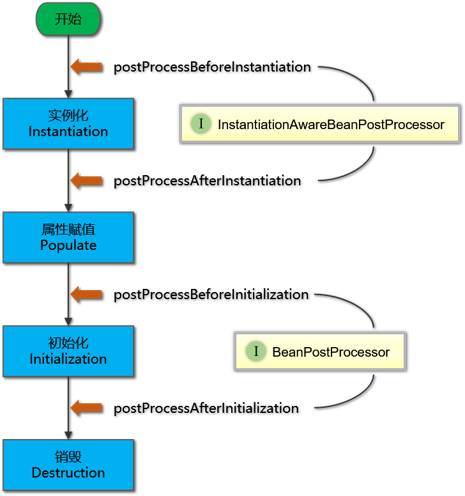
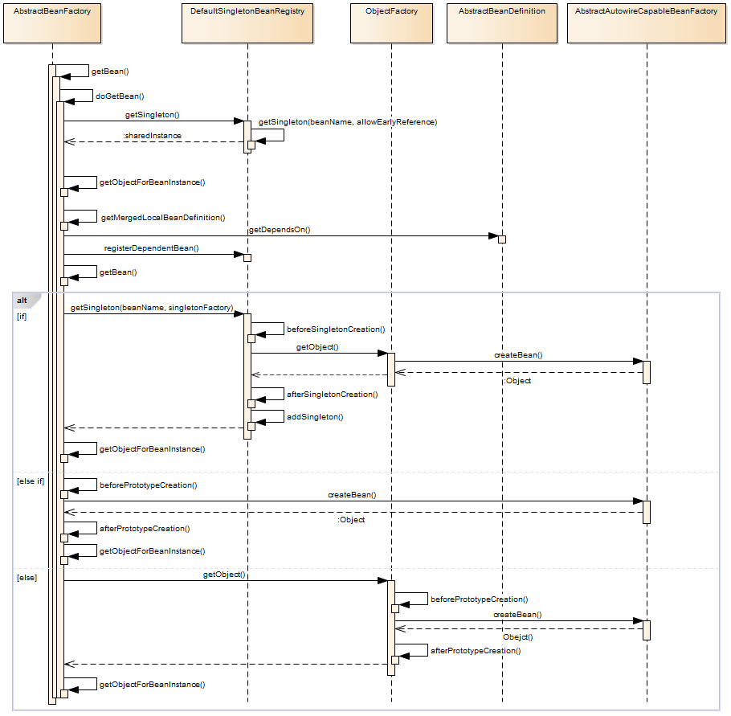
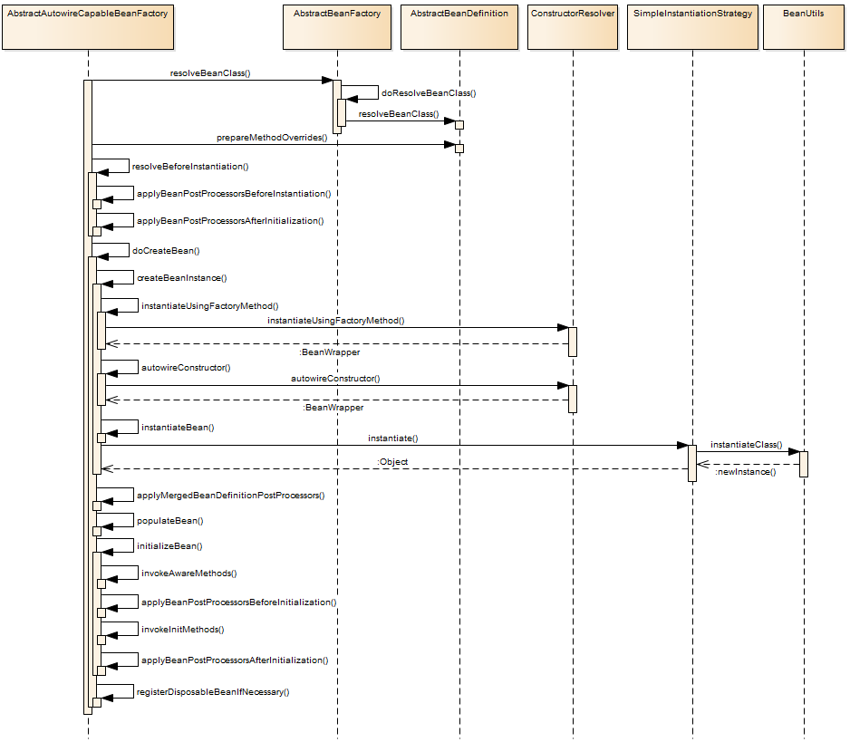

# spring源码解析笔记


## 主要思想
* Spring IOC 将XML解析为 BeanDefinition


## chapter1 基本介绍与源码搭建
* gradle 
* spring-framework 4.3
* from 《云析学院》视频教程


## chapter2 认识Spring IOC 容器
## 基本思想
* spring IOC 
    * 完成对象的创建管理与依赖注入
    * spring控制对象的生命周期以及对象之间的关系

* 面向对象编程的六大原则
    * 1、开闭原则（Open Close Principle）
    * 2、里氏代换原则（Liskov Substitution Principle）
    * 3、依赖倒转原则（Dependence Inversion Principle）
    * 4、接口隔离原则（Interface Segregation Principle）
    * 5、迪米特法则，又称最少知道原则（Demeter Principle）
    * 6、单一职责原则（Single responsibility principle）


## chapter3 Spring容器核心类
### 启动容器时最核心的方法
* org.springframework.context.support.AbstractApplicationContext#refresh


### BeanFactory
* BeanFactory为Spring的IoC容器提供了基础功能。它主要被用于与Spring其他部分以及相关的第三方框架集成，
并且它的子类实现
* 注意点： BeanFactory 与 FactoryBean 有什么异同点
    * https://juejin.cn/post/6844903967600836621
    * FactoryBean 本身是一个工厂bean，为了产生工厂对象而创建，
    * 他们两个都是个工厂，但FactoryBean本质上还是一个Bean，也归BeanFactory管理
    * BeanFactory是Spring容器的顶层接口，FactoryBean更类似于用户自定义的工厂接口。
    * FactoryBean在Spring中最为典型的一个应用就是用来创建AOP的代理对象。
我们知道AOP实际上是Spring在运行时创建了一个代理对象，也就是说这个对象，是我们在运行时创建的，而不是一开始就定义好的，这很符合工厂方法模式。
更形象地说，AOP代理对象通过Java的反射机制，在运行时创建了一个代理对象，在代理对象的目标方法中根据业务要求织入了相应的方法。
这个对象在Spring中就是——ProxyFactoryBean。


``
### DefaultListableBeanFactory
BeanFactory 的子类 DefaultListableBeanFactory是更高级别的GenericApplicationContext容器中的关键委托。


### ApplicationContext
* ApplicationContext接口是由BeanFactory接口派生出来的，所以提供了BeanFactory的所有功能。除此之外，ApplicationContext还提供了如下功能：
    * 通过MessageSource访问i18n消息。
    * 通过ResourceLoader访问资源，如：URL和文件。 
    * 使用ApplicationEventPublisher接口，将事件发布到实现ApplicationListener接口的Bean。
    * 加载多个（分层）上下文，从而允许每个上下文通过HierarchicalBeanFactory接口集中在一个特定层上。如：Web层。


BeanFactory的核心概念就是Bean工厂，用于Bean生命周期的管理，而Applicationcontext除了具有BeanFactory的特性外，还包括消息国际化、资源访问、事件传播等功能。
简而言之，BeanFactory提供了配置框架和基本功能，而ApplicationContext则添加了更多特定的功能。ApplicationContext是BeanFactory的完整超集

### BeanDefinition
Spring IoC容器管理一个或多个Bean。这些Bean是根据程序提供给容器的配置元数据创建的，如：以XML <bean />格式的定义。而在容器内部，这些Bean需要表示为BeanDefinition对象，也就是有一个将Bean解析成Spring内部的BeanDefinition对象的过程。BeanDefinition包含以下元数据信息：
    ● 一个全限定的类名
    ● 用于声明Bean在容器中的行为信息（作用域，生命周期回调等）。
    ● 要完成自身工作需要引用其他的Bean，这些引用也称为依赖项。
    ● 要在新创建的对象中设置的其他配置，如：用于管理连接池的连接数，或池的大小限制。
这些元数据构成每个BeanDefinition的一组属性：
    ● class
    ● name：Bean在容器内的唯一标识符。基于XML的配置，可以使用id或name属来指定Bean标识符
    ● scope：Bean的作用域
    ● constructor arguments：构造函数的参数
    ● properties：Bean包含的属性（依赖注入项）
    ● autowiring mode：自动装配模式
    ● lazy-initialization mode：延迟加载方法
    ● initialization method：初始化方法
    ● destruction method：销毁方法

BeanDefinition继承了AttributeAccessor和BeanMetadataElement接口：
● AttributeAccessor：提供了访问属性的能力
● BeanMetadataElement：用来获取元数据元素的配置源对象

### XMLBeanDefinitionReader
* XML配置文件的读取时Spring的重要功能，因为Spring的大部分功能都是以配置作为切入点的。
    * BeanDefinitionReader	主要定义资源文件读取并转换为BeanDefinition的各个功能
    * EnvironmentCapable	定义获取Environment方法
    * DocumentLoader	定义从资源文件加载到转换为Document的功能
    * AbstractBeanDefinitionReader	对EnvironmentCapable、BeanDefinitionReader类定义的功能进行实现
    * BeanDefinitionDocumentReader	定义读取Document并注册BeanDefiniton功能
    * BeanDefinitionParserDelegate	定义解析Element的各种方法

在XmlBeanDifinitonReader中主要包含以下几个步骤的处理：
● 通过继承自AbstractBeanDefinitionReader中的方法，来使用ResourceLoader将资源文件路径转换为对应的Resource文件。
● 通过DocumentLoader对Resource文件进行转换，将Resource文件转换为Document文件。
● 通过实现接口BeanDefinitionDocumentReader的DefaultBeanDefinitionDocumentReader类对Document进行解析，并使用BeanDefinitionParserDelegate对Element进行解析。

## chapter4 路径和占位符
* 在“占位符解析和替换”代码部分中，我们需要掌握的的知识就是Enviroment，我们可以看到getEnvironment()之后又调用了resolveRequiredPlaceholders函数，这个地方就是占位符解析和替换的工作。
Spring 环境和属性由四个部分组成：
● PropertySource：属性源。key-value 属性对抽象，用于配置数据。
● PropertyResolver：属性解析器。用于解析属性配置。
● Profile：剖面。只有被激活的Profile才会将其中所对应的Bean注册到Spring容器中
● Environment：环境。Profile 和 PropertyResolver 的组合。

PropertySource	提供了可配置属性源上的搜索操作。
PropertyResolver	属性解析器，用于解析任何基础源的属性的接口
ConfigurablePropertyResolver	提供属性类型转换的功能
AbstractPropertyResolver	解析属性文件的抽象基类。设置了解析属性文件所需要ConversionService、prefix、suffix、valueSeparator等信息。
PropertySourcesPropertyResolver	PropertyResolver 的实现，对一组 PropertySources 提供属性解析服务
ConversionService	用于在运行时执行类型转换
Environment	集成在容器中的抽象，它主要包含两个方面：Profiles和Properties
ConfigurableEnvironment	设置激活的 profile 和默认的 profile 的功能以及操作 Properties 的工具


搜索过程是按照层次结构执行的。默认情况下，系统属性优先于环境变量。因此，在调用env.getProperty（"foo"）时，如果在系统属性和环境变量中都设置了foo属性，则系统变量将优先于环境变量。完整层次结构如下所示，优先级最高的条目位于顶部：
● ServletConfig参数
● ServletContext参数
● JNDI环境变量（如："java:comp/env/"）
● JVM system properties（"-D"命令行参数，如-Dfoo="abcd"）
● JVM system environment（操作系统环境变量）
请注意，属性值不会被合并，而是会被前面的条目覆盖。


## chapter5 Spring启动流程1


## chapter11 bean的生命周期
Spring Bean的生命周期只有四个阶段：
1. 实例化（Instantiation）：调用构造函数
2. 属性赋值（Populate）：设置依赖注入
3. 初始化（Initialization）：调用init方法
4. 销毁（Destruction）：调用destory方法







生命周期也可以理解为四个等级。每个等级中都用有相应的接口，实现其中某个接口或者将实现类注入到Spring容器，容器就会在相应的时机调用其方法。
1. 工厂级处理器接口
2. 容器级生命周期接口
3. Bean级生命周期接口
4. Bean本身方法

BeanFactoryPostProcessor	工厂后处理器接口	容器创建完毕，装配Bean源后立即调用
InstantiationAwareBeanPostProcessor	容器后处理器接口	分别在调用构造之前，注入属性之前，实例化完成时调用
BeanPostProcessor	容器后处理器接口	分别在Bean的初始化方法调用前后执行
BeanNameAware	Bean级后置处理器接口	注入属性后调用
BeanFactoryAware	Bean级后置处理器接口	注入属性后调用
InitializingBean	Bean级后置处理器接口	在类本身的初始化方法之前调用其方法（本身也是初始化方法）
DisposableBean	Bean级后置处理器接口	在类本身的销毁方法执行之前调用其方法（本身也是销毁方法）
init方法	Bean本身方法	在注入属性之后调用初始化方法
destroy方法	Bean本身方法	在关闭容器的时候进行销毁


Spring中Bean初始化/销毁的三种方法
1. 通过实现 InitializingBean/DisposableBean 接口来定制初始化之后/销毁之前的操作方法；
2. 在<bean> 元素上添加 init-method/destroy-method来指定初始化之后 /销毁之前调用的操作方法；
3. 在方法上加上@PostConstruct 或@PreDestroy注解来指定该方法是在初始化之后还是销毁之前调用。

Spring Bean 详细的生命周期：
1. Spring对Bean进行实例化，调用Bean的构造参数
2. 设置对象属性，调用Bean的set方法，将属性注入到bean的属性中
3. 检查Bean是否实现BeanNameAware、BeanFactoryAware、ApplicationContextAware接口，如果实现了这几个接口Spring会分别调用其中实现的方法。
4. 如果Bean是否实现BeanPostProcessor接口，Spring会在初始化方法的前后分别调用postProcessBeforeInitialization和postProcessAfterInitialization方法
5. 如果Bean是否实现InitalizingBean接口，将调用afterPropertiesSet()方法
6. 如果Bean声明初始化方法，也会被调用
7. 使用Bean。Bean将会一直保留在应用的上下文中，直到该应用上下文被销毁。
8. 检查Bean是否实现DisposableBean接口，Spring会调用它们的destory方法
9. 如果Bean声明销毁方法，该方法也会被调用


bean的获取流程







## chaprer19 Spring注解上下文和注释
Spring3.0之后，提供了使用AnnotationConfigApplicationContext来实现基于Java配置类加载Spring应用上下文的功能。这种方式可以避免使用application.xml进行配置，相比XML配置这种方式也更加便捷。
这种ApplicationContext实现不仅能够接受@Configuration类作为输入，而且还可以接受@Component注解类和带有JSR-330元数据注解的类。


### AnnotationBeanDefinition
该接口继承自BeanDefinition接口
```java
public interface AnnotatedBeanDefinition extends BeanDefinition {

	// 获取注解元数据
	AnnotationMetadata getMetadata();

	// 获取此Bean定义的工厂方法的元数据
    // 如果在配置类中使用了@Bean注解，被@Bean标记的方法就会被解析为FactoryMethodMetadata
	MethodMetadata getFactoryMethodMetadata();
}

```


1. AnnotatedGenericBeanDefinition
```java
public static void main(String[] args) {
    AnnotationConfigApplicationContext ctx = new AnnotationConfigApplicationContext();
    ctx.register(JavaConfig.class);
}
```
如上代码块中JavaConfig，和使用@Import注解导入的类，都会被解析为这种类型。
2. ScannedGenericBeanDefinition
通过注解扫描类，如@Service @Compnent等配置的方式，都会被解析为ScannedGenericBeanDefinition。
3. ConfigurationClassBeanDefinition
通过使用@Bean注解配置的方式，都会被解析为ConfigurationClassBeanDefinition。


```java
public class AnnotationConfigApplicationContext {

    // 注册带注解的Bean（编程方式注册，仅适用于显式注册的类）
    private final AnnotatedBeanDefinitionReader reader;
    
    // 扫描方式注册带注解的Bean（Bean定义扫描器，检测指定路径中的Bean候选者）
    private final ClassPathBeanDefinitionScanner scanner;
    
    // AnnotationConfigApplicationContext默认构造函数
    public AnnotationConfigApplicationContext() {
        this.reader = new AnnotatedBeanDefinitionReader(this);
        this.scanner = new ClassPathBeanDefinitionScanner(this);
    }
    
    // 使用BeanFactory创建一个新的AnnotationConfigApplicationContext
    public AnnotationConfigApplicationContext(DefaultListableBeanFactory beanFactory) {
        super(beanFactory);
        this.reader = new AnnotatedBeanDefinitionReader(this);
        this.scanner = new ClassPathBeanDefinitionScanner(this);
    }
    
    // 使用给定的带注解的类创建AnnotationConfigApplicationContext，并刷新上下文
    public AnnotationConfigApplicationContext(Class<?>... annotatedClasses) {
        this();
        register(annotatedClasses);
        // 刷新上下文
        refresh();
    }
    
    // 创建AnnotationConfigApplicationContext，扫描指定包路径中的Bean定义
    public AnnotationConfigApplicationContext(String... basePackages) {
        this();
        scan(basePackages);
        // 刷新上下文
        refresh();
    }
}
```


```java
public class AnnotatedBeanDefinitionReader {
    public void registerBean(Class<?> annotatedClass, String name, Class<? extends Annotation>... qualifiers) {
        // BeanDefinition定义，增加了注解元数据的支持
        AnnotatedGenericBeanDefinition abd = new AnnotatedGenericBeanDefinition(annotatedClass);
        // 检测是否需要跳过@Conditional注解
        if (this.conditionEvaluator.shouldSkip(abd.getMetadata())) {
            return;
        }
    
        // 解析对应的Scope
        ScopeMetadata scopeMetadata = this.scopeMetadataResolver.resolveScopeMetadata(abd);
        // 设置abd的Scope
        abd.setScope(scopeMetadata.getScopeName());
        // 使用BeanNameGenerator生成对应的beanName
        String beanName = (name != null ? name : this.beanNameGenerator.generateBeanName(abd, this.registry));
        // 对常用注解进行处理
        AnnotationConfigUtils.processCommonDefinitionAnnotations(abd);
        // 除了Bean类级别的限定符外，还需要处理特定限定符注解
        if (qualifiers != null) {
            for (Class<? extends Annotation> qualifier : qualifiers) {
                if (Primary.class == qualifier) {
                    abd.setPrimary(true);
                }
                else if (Lazy.class == qualifier) {
                    abd.setLazyInit(true);
                }
                else {
                    abd.addQualifier(new AutowireCandidateQualifier(qualifier));
                }
            }
        }
    
        // 定义BeanDefinition和beanName的映射关系类
        BeanDefinitionHolder definitionHolder = new BeanDefinitionHolder(abd, beanName);
        // 为组件设置Scope代理（如果有的话）
        definitionHolder = AnnotationConfigUtils.applyScopedProxyMode(scopeMetadata, definitionHolder, this.registry);
        // 注册BeanDefinition到容器并且注册别名
        BeanDefinitionReaderUtils.registerBeanDefinition(definitionHolder, this.registry);
    }

}
```


@ComponentScan
根据指定的配置自动扫描组件，通常与@Configuration注解一起使用。该注解与Spring XML配置文件中的<context:component-scan>元素作用相同。


