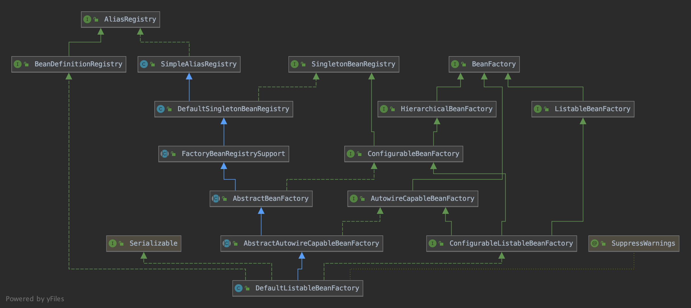
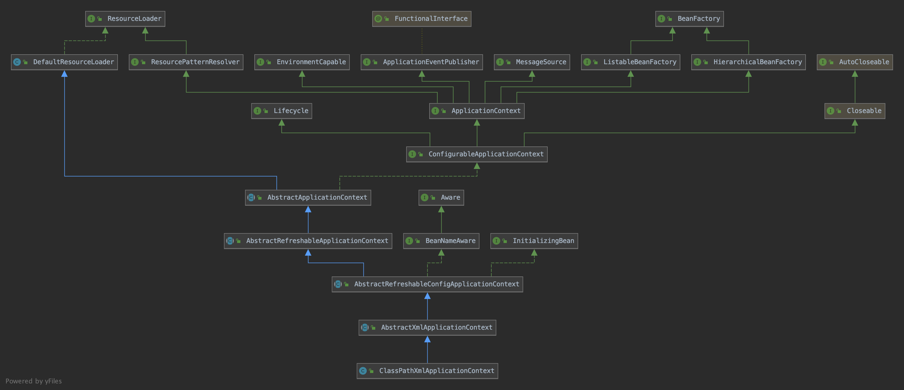

# spring源码解析笔记

## chapter1 基本介绍与源码搭建
* gradle 
* spring-framework 4.3
* from 《云析学院》视频教程

## chapter2 认识Spring IOC 容器
## 基本思想
* spring IOC 
    * 完成对象的创建管理与依赖注入
    * spring控制对象的生命周期以及对象之间的关系

* 面向对象编程的六大原则
    * 1、开闭原则（Open Close Principle）
    * 2、里氏代换原则（Liskov Substitution Principle）
    * 3、依赖倒转原则（Dependence Inversion Principle）
    * 4、接口隔离原则（Interface Segregation Principle）
    * 5、迪米特法则，又称最少知道原则（Demeter Principle）
    * 6、单一职责原则（Single responsibility principle）

## chapter3 Spring容器核心类
### 启动容器时最核心的方法
* org.springframework.context.support.AbstractApplicationContext#refresh

### BeanFactory
* BeanFactory为Spring的IoC容器提供了基础功能。它主要被用于与Spring其他部分以及相关的第三方框架集成，
并且它的子类实现
* 注意点： BeanFactory 与 FactoryBean 有什么异同点
    * https://juejin.cn/post/6844903967600836621
    * FactoryBean 本身是一个工厂bean，为了产生工厂对象而创建，
    * 他们两个都是个工厂，但FactoryBean本质上还是一个Bean，也归BeanFactory管理
    * BeanFactory是Spring容器的顶层接口，FactoryBean更类似于用户自定义的工厂接口。
    * FactoryBean在Spring中最为典型的一个应用就是用来创建AOP的代理对象。
我们知道AOP实际上是Spring在运行时创建了一个代理对象，也就是说这个对象，是我们在运行时创建的，而不是一开始就定义好的，这很符合工厂方法模式。
更形象地说，AOP代理对象通过Java的反射机制，在运行时创建了一个代理对象，在代理对象的目标方法中根据业务要求织入了相应的方法。
这个对象在Spring中就是——ProxyFactoryBean。

### DefaultListableBeanFactory
BeanFactory 的子类 DefaultListableBeanFactory是更高级别的GenericApplicationContext容器中的关键委托。

### ApplicationContext
* ApplicationContext接口是由BeanFactory接口派生出来的，所以提供了BeanFactory的所有功能。除此之外，ApplicationContext还提供了如下功能：
    * 通过MessageSource访问i18n消息。
    * 通过ResourceLoader访问资源，如：URL和文件。 
    * 使用ApplicationEventPublisher接口，将事件发布到实现ApplicationListener接口的Bean。
    * 加载多个（分层）上下文，从而允许每个上下文通过HierarchicalBeanFactory接口集中在一个特定层上。如：Web层。

BeanFactory的核心概念就是Bean工厂，用于Bean生命周期的管理，而Applicationcontext除了具有BeanFactory的特性外，还包括消息国际化、资源访问、事件传播等功能。
简而言之，BeanFactory提供了配置框架和基本功能，而ApplicationContext则添加了更多特定的功能。ApplicationContext是BeanFactory的完整超集

### BeanDefinition
Spring IoC容器管理一个或多个Bean。这些Bean是根据程序提供给容器的配置元数据创建的，如：以XML <bean />格式的定义。而在容器内部，这些Bean需要表示为BeanDefinition对象，也就是有一个将Bean解析成Spring内部的BeanDefinition对象的过程。BeanDefinition包含以下元数据信息：
    ● 一个全限定的类名
    ● 用于声明Bean在容器中的行为信息（作用域，生命周期回调等）。
    ● 要完成自身工作需要引用其他的Bean，这些引用也称为依赖项。
    ● 要在新创建的对象中设置的其他配置，如：用于管理连接池的连接数，或池的大小限制。
这些元数据构成每个BeanDefinition的一组属性：
    ● class
    ● name：Bean在容器内的唯一标识符。基于XML的配置，可以使用id或name属来指定Bean标识符
    ● scope：Bean的作用域
    ● constructor arguments：构造函数的参数
    ● properties：Bean包含的属性（依赖注入项）
    ● autowiring mode：自动装配模式
    ● lazy-initialization mode：延迟加载方法
    ● initialization method：初始化方法
    ● destruction method：销毁方法

BeanDefinition继承了AttributeAccessor和BeanMetadataElement接口：
● AttributeAccessor：提供了访问属性的能力
● BeanMetadataElement：用来获取元数据元素的配置源对象

### XMLBeanDefinitionReader
* XML配置文件的读取时Spring的重要功能，因为Spring的大部分功能都是以配置作为切入点的。
    * BeanDefinitionReader	主要定义资源文件读取并转换为BeanDefinition的各个功能
    * EnvironmentCapable	定义获取Environment方法
    * DocumentLoader	定义从资源文件加载到转换为Document的功能
    * AbstractBeanDefinitionReader	对EnvironmentCapable、BeanDefinitionReader类定义的功能进行实现
    * BeanDefinitionDocumentReader	定义读取Document并注册BeanDefiniton功能
    * BeanDefinitionParserDelegate	定义解析Element的各种方法

在XmlBeanDifinitonReader中主要包含以下几个步骤的处理：
● 通过继承自AbstractBeanDefinitionReader中的方法，来使用ResourceLoader将资源文件路径转换为对应的Resource文件。
● 通过DocumentLoader对Resource文件进行转换，将Resource文件转换为Document文件。
● 通过实现接口BeanDefinitionDocumentReader的DefaultBeanDefinitionDocumentReader类对Document进行解析，并使用BeanDefinitionParserDelegate对Element进行解析。

## chapter4 路径和占位符
* 在“占位符解析和替换”代码部分中，我们需要掌握的的知识就是Enviroment，我们可以看到getEnvironment()之后又调用了resolveRequiredPlaceholders函数，这个地方就是占位符解析和替换的工作。
Spring 环境和属性由四个部分组成：
● PropertySource：属性源。key-value 属性对抽象，用于配置数据。
● PropertyResolver：属性解析器。用于解析属性配置。
● Profile：剖面。只有被激活的Profile才会将其中所对应的Bean注册到Spring容器中
● Environment：环境。Profile 和 PropertyResolver 的组合。

PropertySource	提供了可配置属性源上的搜索操作。
PropertyResolver	属性解析器，用于解析任何基础源的属性的接口
ConfigurablePropertyResolver	提供属性类型转换的功能
AbstractPropertyResolver	解析属性文件的抽象基类。设置了解析属性文件所需要ConversionService、prefix、suffix、valueSeparator等信息。
PropertySourcesPropertyResolver	PropertyResolver 的实现，对一组 PropertySources 提供属性解析服务
ConversionService	用于在运行时执行类型转换
Environment	集成在容器中的抽象，它主要包含两个方面：Profiles和Properties
ConfigurableEnvironment	设置激活的 profile 和默认的 profile 的功能以及操作 Properties 的工具

搜索过程是按照层次结构执行的。默认情况下，系统属性优先于环境变量。因此，在调用env.getProperty（"foo"）时，如果在系统属性和环境变量中都设置了foo属性，则系统变量将优先于环境变量。完整层次结构如下所示，优先级最高的条目位于顶部：
● ServletConfig参数
● ServletContext参数
● JNDI环境变量（如："java:comp/env/"）
● JVM system properties（"-D"命令行参数，如-Dfoo="abcd"）
● JVM system environment（操作系统环境变量）
请注意，属性值不会被合并，而是会被前面的条目覆盖。

## chapter5 Spring启动流程1

## chapter6 

