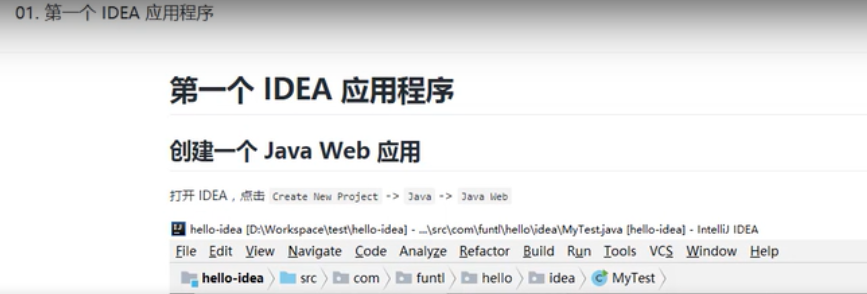

## markdown 记笔记实例

#### 图片



#### 超链接
[学习的博客网站超链接](www.funtl.com)

#### 无序列表
* 无序列表1
  * 无序字列表1
    * 无序列表

#### 嵌入代码
```java
@EnableDiscoveryClient
@SpringBootApplication
public class HelloServiceApplication {
    public static void main(String[] args) {
        SpringApplication.run(HelloServiceApplication.class, args);
    }
}
```


### 标题


### 字体样式-例子

后面俩字**加黑**
后面俩字*斜体*


### 引用-例子


> 引用块段落一。
> 3333
> 引用块段落二。
>> 内嵌引用块段落一。
>
> ### 引用块内的标题


### 超链接-例子

行内式 [博客](https://mazhuang.org "我的个人博客") 链接，带 title。

行内式 [GitHub](https://github.com/mzlogin) 链接。

引用式 [博客][1] 链接。

引用式 [GitHub][2] 链接，带 title。

[1]: https://mazhuang.org
[2]: https://github.com/mzlogin "我的 GitHub 主页"


### 图片-例子


### 水平分割线-例子
***
-----
- - -


### 表格-例子

| 编号  | 姓名（左） | 年龄（右） | 性别（中） |
| ----- | :--------  | ---------: | :------:   |
| 0     | 张三       | 28         | 男         |
| 1     | 李四       | 29         | 男         |


### 任务列表-例子

- [x] 洗碗
- [ ] 清洗油烟机
- [ ] 拖地

### 删除线-例子
后面三个字打上~~删除线~~。

### 自动链接-例子
https://github.com

<example@gmail.com>


### emoji-例子
:camel: :blush: :smile:


