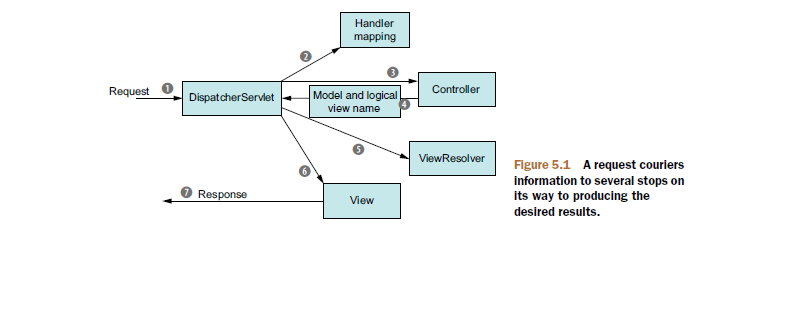

## 千峰教育-李卫民-走向单体地域教程

#### 学习备注
* 所有相关的基础模块笔记都已分散至对应的笔记模块
* 学习链接：https://www.bilibili.com/video/av29299488/


## MVC + 三层架构
### 什么是系统架构
所谓系统架构是指，整合应用系统程序大的结构。经常提到的系统结构有两种：三层架构与 MVC。这两种结构既有区别，又有联系。但这两种结构的使用，均是为了降低系统模块间的耦合度
### 三层架构
视图层 View、服务层 Service，与持久层 DAO。它们分别完成不同的功能。

* View 层：用于接收用户提交请求的代码
* Service 层：系统的业务逻辑主要在这里完成
* DAO 层：直接操作数据库的代码

为了更好的降低各层间的耦合度，在三层架构程序设计中，采用面向抽象编程。即上层对下层的调用，是通过接口实现的。而下层对上层的真正服务提供者，是下层接口的实现类。服务标准（接口）是相同的，服务提供者（实现类）可以更换。这就实现了层间解耦合。
* 简单业务：只开启一个事务
* 普通业务：开启三个事务
* 负责业务：开启7个业务

耦合度：多张表之间有依赖关系、强关联性

高内聚、低耦合：
* 一个类只做一种事
* 一个方法只做一件事
* 写且只写一次

### MVC模式
MVC，即 Model 模型、View 视图，及 Controller 控制器。

* View：视图，为用户提供使用界面，与用户直接进行交互。
* Model：模型，承载数据，并对用户提交请求进行计算的模块。其分为两类，一类称为数据承载 Bean，一类称为业务处理 Bean。所谓数据承载 Bean 是指实体类，专门用户承载业务数据的，如 Student、User 等。而业务处理 Bean 则是指 Service 或 Dao 对象， 专门用于处理用户提交请求的。
* Controller：控制器，用于将用户请求转发给相应的 Model 进行处理，并根据 Model 的计算结果向用户提供相应响应。

重构原则：事不过三，三则重构

### 三层架构实战demo
请求方式的区别（主要区别是语义的区别）
HTTP只是个行为准则，而TCP才是GET和POST怎么实现的基本。
GET和POST本质上就是TCP链接，并无差别。但是由于HTTP的规定和浏览器/服务器的限制，导致他们在应用过程中体现出一些不同。

GET产生一个TCP数据包；POST产生两个TCP数据包。
对于GET方式的请求，浏览器会把http header和data一并发送出去，服务器响应200（返回数据）；
而对于POST，浏览器先发送header，服务器响应100 continue，浏览器再发送data，服务器响应200 ok（返回数据）。
* GET：获取数据
* POST：提交数据，产生两次TCP数据包，第一次讯问服务器是否能够传输数据，第二次才是真正的传输数据


## Bootstrap
自学要求：
* 简单的技术或框架：一天上手
* 复杂的技术或框架：三天上手

Bootstrap是CSS/HTML框架，jquery是JavaScript框架
技术选型：
* 根据搜索量来查看：比如百度指数：查看增长趋势
* 社区活跃度：需要文档完备性，参考 github star的个数 >10000  说明很活跃
* 是否开源

* 渐进增强：向上兼容
* 优雅降级：向下兼容

布局的方式：
* table表格
  - 缺点：表格中所有的项目都加载完毕才能显示
* dic + css
  - 代码从上往下执行，加载一点，显示一点
  - 布局难度较大
* 网格化
  - 用 div + css 的样式写表格

### Bootstrap网格系统
Bootstrap 官方文档中有关网格系统的描述：
```
Bootstrap 包含了一个响应式的、移动设备优先的、不固定的网格系统，可以随着设备或视口大小的增加而适当地扩展到 12 列。它包含了用于简单的布局选项的预定义类，也包含了用于生成更多语义布局的功能强大的混合类。
```

#### Bootstrap 网格系统（Grid System）的工作原理
网格系统通过一系列包含内容的行和列来创建页面布局。下面列出了 Bootstrap 网格系统是如何工作的：

* 行必须放置在 .container class 内，以便获得适当的对齐（alignment）和内边距（padding）
* 使用行来创建列的水平组
* 内容应该放置在列内，且唯有列可以是行的直接子元素
* 预定义的网格类，比如 .row 和 .col-xs-4，可用于快速创建网格布局。LESS 混合类可用于更多语义布局
* 列通过内边距（padding）来创建列内容之间的间隙。该内边距是通过 .rows 上的外边距（margin）取负，表示第一列和最后一列的行偏移
* 网格系统是通过指定您想要横跨的十二个可用的列来创建的。例如，要创建三个相等的列，则使用三个 .col-xs-4

CSS3新特性：媒体查询
* css样式生效原则： 就近原则， !important 会让样式强制生效

### Bootstrap表格+字体图标
* 微软雅黑：字体收费，不能用于商业模式
* 字体是矢量图，不失真

其它字体图标库
* FontAwesome：http://fontawesome.dashgame.com/
* LineAwesome：https://icons8.com/line-awesome
* SocialIcons：http://www.socicon.com/chart.php
* 阿里巴巴矢量图标库：http://www.iconfont.cn/

## Spring框架
spring主要为了解决企业级开发的复杂度问题，“胶水框架”

Spring 的主要作用就是为代码“解耦”，降低代码间的耦合度。

* 根据功能的不同，可以将一个系统中的代码分为 主业务逻辑 与 系统级业务逻辑 两类。它们各自具有鲜明的特点：主业务代码间逻辑联系紧密，有具体的专业业务应用场景，复用性相对较低；系统级业务相对功能独立，没有具体的专业业务应用场景，主要是为主业务提供系统级服务，如日志、安全、事务等，复用性强。
* Spring 根据代码的功能特点，将降低耦合度的方式分为了两类：IoC 与 AOP。IoC 使得主业务在相互调用过程中，不用再自己维护关系了，即不用再自己创建要使用的对象了。而是由 Spring 容器统一管理，自动“注入”。而 AOP 使得系统级服务得到了最大复用，且不用再由程序员手工将系统级服务“混杂”到主业务逻辑中了，而是由 Spring 容器统一完成“织入”。
* Spring 是于 2003 年兴起的一个轻量级的 Java 开发框架，它是为了解决企业应用开发的复杂性而创建的。Spring 的核心是控制反转（IoC）和面向切面编程（AOP）。简单来说，Spring 是一个分层的 Java SE/EE full-stack(一站式)轻量级开源框架


#### 非侵入式
所谓非侵入式是指，Spring 框架的 API 不会在业务逻辑上出现，即业务逻辑是 POJO。由于业务逻辑中没有 Spring 的 API，所以业务逻辑可以从 Spring 框架快速的移植到其他框架， 即与环境无关。

控制反转（IoC，Inversion of Control），是一个概念，是一种思想。指将传统上由程序代码直接操控的对象调用权交给容器，通过容器来实现对象的装配和管理。控制反转就是对对象控制权的转移，从程序代码本身反转到了外部容器。

IoC 是一个概念，是一种思想，其实现方式多种多样。当前比较流行的实现方式有两种： 依赖注入和依赖查找。依赖注入方式应用更为广泛。

依赖查找：Dependency Lookup，DL，容器提供回调接口和上下文环境给组件，程序代码则需要提供具体的查找方式。比较典型的是依赖于 JNDI 系统的查找。
**依赖注入**:Dependency Injection，DI，程序代码不做定位查询，这些工作由容器自行完成。
依赖注入 DI 是指程序运行过程中，若需要调用另一个对象协助时，无须在代码中创建被调用者，而是依赖于外部容器，由外部容器创建后传递给程序。

Spring 的依赖注入对调用者与被调用者几乎没有任何要求，完全支持 POJO 之间依赖关系的管理。

依赖注入是目前最优秀的解耦方式。依赖注入让 Spring 的 Bean 之间以配置文件的方式组织在一起，而不是以硬编码的方式耦合在一起的。

#### 单元测试
* TDD 测试驱动开发
* DDD 领域驱动设计

测试的种类
* 单元测试
  - 白盒测试：能够看到源码
  - 黑盒测试：没有源码，功能测试
  - 灰盒测试
* 压力测试
* 疲劳强度测试：72小时 - 7天
* 冒烟测试：对主要流程测试，支付环节
* 集成测试：完整功能的测试，测试业务流程
* 回归测试：增加一个功能
* 自动化测试：编码 + 场景设计

## JUnit单元测试

@Test
public void method()	测试注释指示该公共无效方法它所附着可以作为一个测试用例。

@Before
public void method()	Before 注释表示，该方法必须在类中的每个测试之前执行，以便执行测试某些必要的先决条件。

@BeforeClass
public static void method()	BeforeClass 注释指出这是附着在静态方法必须执行一次并在类的所有测试之前。发生这种情况时一般是测试计算共享配置方法(如连接到数据库)。

@After
public void method()	After 注释指示，该方法在执行每项测试后执行(如执行每一个测试后重置某些变量，删除临时变量等)


@AfterClass
public static void method()	当需要执行所有的测试在 JUnit 测试用例类后执行，AfterClass 注解可以使用以清理建立方法，(从数据库如断开连接)。注意：附有此批注(类似于 BeforeClass)的方法必须定义为静态。

@Ignore
public static void method()	当想暂时禁用特定的测试执行可以使用忽略注释。每个被注解为 @Ignore 的方法将不被执行。

#### 断言
* void assertEquals([String message], expected value, actual value)	断言两个值相等。值可能是类型有 int, short, long, byte, char or java.lang.Object. 第一个参数是一个可选的字符串消息
* void assertTrue([String message], boolean condition)	断言一个条件为真
* void assertFalse([String message],boolean condition)	断言一个条件为假
* void assertNotNull([String message], java.lang.Object object)	断言一个对象不为空(null)
* void assertNull([String message], java.lang.Object object)	断言一个对象为空(null)
* void assertSame([String message], java.lang.Object expected, java.lang.Object actual)	断言，两个对象引用相同的对象
* void assertNotSame([String message], java.lang.Object unexpected, java.lang.Object actual)	断言，两个对象不是引用同一个对象
* void assertArrayEquals([String message], expectedArray, resultArray)	断言预期数组和结果数组相等。数组的类型可能是 int, long, short, char, byte or java.lang.Object

## log4j(log for java)
现在一般采用 log-back 框架
日志属性配置文件

日志属性文件 log4j.properties 是专门用于控制日志输出的。其主要进行三方面控制：
*  输出位置：控制日志将要输出的位置，是控制台还是文件等。
*  输出布局：控制日志信息的显示形式。
*  输出级别：控制要输出的日志级别。

日志属性文件由两个对象组成：日志附加器与根日志。
* 根日志，即为 Java 代码中的日志记录器，其主要由两个属性构成：日志输出级别与日志附加器。
* 日志附加器，则由日志输出位置定义，由其它很多属性进行修饰，如输出布局、文件位置、文件大小等。

#### 什么是日志附加器？
所谓日志附加器，就是为日志记录器附加上很多其它设置信息。附加器的本质是一个接口，其定义语法为：log4j.appender.appenderName = 输出位置

#### 常用的附加器实现类
* org.apache.log4j.ConsoleAppender：日志输出到控制台
* org.apache.log4j.FileAppender：日志输出到文件
* org.apache.log4j.RollingFileAppender：当日志文件大小到达指定尺寸的时候将产生一个新的日志文件
* org.apache.log4j.DailyRollingFileAppender：每天产生一个日志文件
#### 常用布局类型
* org.apache.log4j.HTMLLayout：网页布局，以 HTML 表格形式布局
* org.apache.log4j.SimpleLayout：简单布局，包含日志信息的级别和信息字符串
* org.apache.log4j.PatternLayout：匹配器布局，可以灵活地指定布局模式。其主要是通过设置 PatternLayout 的 ConversionPattern 属性值来控制具体输出格式的 。

打印参数: Log4J 采用类似 C 语言中的 printf 函数的打印格式格式化日志信息
* %m：输出代码中指定的消息
* %p：输出优先级，即 DEBUG，INFO，WARN，ERROR，FATAL
* %r：输出自应用启动到输出该 log 信息耗费的毫秒数
* %c：输出所属的类目，通常就是所在类的全名
* %t：输出产生该日志事件的线程名
* %n：输出一个回车换行符，Windows 平台为 /r/n，Unix 平台为 /n
* %d：输出日志时间点的日期或时间，默认格式为 ISO8601，也可以在其后指定格式，比如：%d{yyy MMM dd HH:mm:ss , SSS}，输出类似：2002年10月18日 22:10:28,921
* %l：输出日志事件的发生位置，包括类目名、发生的线程，以及在代码中的行数。举例：Testlog4.main(TestLog4.java: 10 )

### slf4j
slf4j 的全称是 Simple Loging Facade For Java，即它仅仅是一个为 Java 程序提供日志输出的统一接口，并不是一个具体的日志实现方案，就比如 JDBC 一样，只是一种规则而已。所以单独的 slf4j 是不能工作的，必须搭配其他具体的日志实现方案，比如 apache 的 org.apache.log4j.Logger，JDK 自带的 java.util.logging.Logger 以及 log4j 等

#### 创建 log4j.properties 配置文件
在 src/main/resources 目录下创建名为 log4j.properties 的属性配置文件
```
  log4j.rootLogger=INFO, console, file

  log4j.appender.console=org.apache.log4j.ConsoleAppender
  log4j.appender.console.layout=org.apache.log4j.PatternLayout
  log4j.appender.console.layout.ConversionPattern=%d %p [%c] - %m%n

  log4j.appender.file=org.apache.log4j.DailyRollingFileAppender
  log4j.appender.file.File=logs/log.log
  log4j.appender.file.layout=org.apache.log4j.PatternLayout
  log4j.appender.A3.MaxFileSize=1024KB
  log4j.appender.A3.MaxBackupIndex=10
  log4j.appender.file.layout.ConversionPattern=%d %p [%c] - %m%n
```
日志配置相关说明：
```
  log4j.rootLogger：根日志，配置了日志级别为 INFO，预定义了名称为 console、file 两种附加器
  log4j.appender.console：console 附加器，日志输出位置在控制台
  log4j.appender.console.layout：console 附加器，采用匹配器布局模式
  log4j.appender.console.layout.ConversionPattern：console 附加器，日志输出格式为：日期 日志级别 [类名] - 消息换行符
  log4j.appender.file：file 附加器，每天产生一个日志文件
  log4j.appender.file.File：file 附加器，日志文件输出位置 logs/log.log
  log4j.appender.file.layout：file 附加器，采用匹配器布局模式
  log4j.appender.A3.MaxFileSize：日志文件最大值
  log4j.appender.A3.MaxBackupIndex：最多纪录文件数
  log4j.appender.file.layout.ConversionPattern：file 附加器，日志输出格式为：日期 日志级别 [类名] - 消息换行符
```

#### 占位符说明
打日志的时候使用了 {} 占位符，这样就不会有字符串拼接操作，减少了无用 String 对象的数量，节省了内存。并且，记住，在生产最终日志信息的字符串之前，这个方法会检查一个特定的日志级别是不是打开了，这不仅降低了内存消耗而且预先降低了 CPU 去处理字符串连接命令的时间。

## 综合复习实战
material design  配色设计相关
科技行业：蓝色为主
AdminLTE   bootstrap模板
https://www.bilibili.com/video/av29299488/?p=43

前端页面是通过jsp实现的

JSTL（Java server pages standarded tag library，即JSP标准标签库）是由JCP（Java community Proces）所制定的标准规范，它主要提供给Java Web开发人员一个标准通用的标签库，并由Apache的Jakarta小组来维护。开发人员可以利用这些标签取代JSP页面上的Java代码，从而提高程序的可读性，降低程序的维护难度。

**实现的demo** ：E:\GIT_ZHQ\shop-learning-demo\my-shop

## Spring Web 与 Bean 装配

当一个类实现了这个接口（ApplicationContextAware）之后，这个类就可以方便获得 ApplicationContext 中的所有 bean。换句话说，就是这个类可以直接获取 Spring 配置文件中，所有有引用到的 Bean 对象。

* 单例：系统中只有一个实例（spring默认模式）
* 原型：每次调用都会产生一个新的实例

#### 容器中 Bean 的作用域
在学习 Bean 的装配方式之前，我们先了解一下 Bean 的作用域。当通过 Spring 容器创建一个 Bean 实例时，不仅可以完成 Bean 的实例化，还可以通过 scope 属性，为 Bean 指定特定的作用域。Spring 支持 5 种作用域。

  * singleton：单态模式。即在整个 Spring 容器中，使用 singleton 定义的 Bean 将是单例的，只有一个实例。默认为单态的。
  * prototype：原型模式。即每次使用 getBean 方法获取的同一个 <bean /> 的实例都是一个新的实例。
  * request：对于每次 HTTP 请求，都将会产生一个不同的 Bean 实例。
  * session：对于每个不同的 HTTP session，都将产生一个不同的 Bean 实例。
  * global session：每个全局的 HTTP session 对应一个 Bean 实例。典型情况下，仅在使用 portlet 集群时有效，多个 Web 应用共享一个 session。一般应用中，global-session 与 session 是等同的。
  * 注意事项：对于 scope 的值 request、session 与 global session，只有在 Web 应用中使用 Spring 时，该作用域才有效。
  对于 scope 为 singleton 的单例模式，该 Bean 是在容器被创建时即被装配好了。对于 scope 为 prototype 的原型模式，Bean 实例是在代码中使用该 Bean 实例时才进行装配的。

#### 注解与 XML 配置的区别
* 注解的好处是，配置方便，直观。但其弊端也显而易见：以硬编码的方式写入到了 Java 代码中，其修改是需要重新编译代码的。
* XML 配置方式的最大好处是，对其所做修改，无需编译代码，只需重启服务器即可将新的配置加载。
* 若注解与 XML 同用，XML 的优先级要高于注解。这样做的好处是，需要对某个 Bean 做修改，只需修改配置文件即可。


## 登录页面记住我功能

### 浏览器端存储技术简介
#### Cookie
Cookie 是指存储在用户本地终端上的数据，同时它是与具体的 Web 页面或者站点相关的。Cookie 数据会自动在 Web 浏览器和 Web 服务器之间传输，也就是说 HTTP 请求发送时，会把保存在该请求域名下的所有 Cookie 值发送给 Web 服务器，因此服务器端脚本是可以读、写存储在客户端的 Cookie 的操作。
#### LocalStorage
在 HTML5 中，新加入了一个 localStorage 特性，这个特性主要是用来作为本地存储来使用的，解决了 Cookie 存储空间不足的问题(Cookie 中每条 Cookie 的存储空间为 4k)，localStorage 中一般浏览器支持的是 5M 大小，这个在不同的浏览器中 localStorage 会有所不同。
#### SessionStorage
SessionStorage 与 LocalStorage 的唯一一点区别就是 LocalStorage 属于永久性存储，而 SessionStorage 属于当会话结束的时候，SessionStorage 中的键值对就会被清空。
#### UserData、GlobalStorage、Google Gear
这三种的使用都有一定的局限性，例如
userData 是 IE 浏览器专属，它的容量可以达到 640K，这种方案可靠，不需要安装额外插件，只不过它仅在IE下有效
globalStorage 适用于 Firefox 2+ 的浏览器，类似于 IE 的 userData
google gear 是谷歌开发出的一种本地存储技术，需要安装 Gear 组件
#### Flash ShareObject（Flash Cookie）
这种方式能能解决上面提到的 Cookie 存储的两个弊端，而且能够跨浏览器，应该说是目前最好的本地存储方案。不过，需要在页面中插入一个 Flash，当浏览器没有安装 Flash 控件时就不能用了。所幸的是，没有安装 Flash 的用户极少。

CookieUtils  这种常用的util可以通过网上百度解决

## Spring MVC

### 概述
Spring MVC 也叫 Spring Web MVC ，属于展示层框架。SpringMVC 是 Spring 框架的一部分。Spring Web MVC 框架提供了 MVC (模型 - 视图 - 控制器) 架构和用于开发灵活和松散耦合的 Web 应用程序的组件。 MVC 模式导致应用程序的不同方面(输入逻辑，业务逻辑和 UI 逻辑)分离，同时提供这些元素之间的松散耦合。
* 模型 (Model)：封装了应用程序数据，通常它们将由 POJO 类组成。
* 视图 (View)：负责渲染模型数据，一般来说它生成客户端浏览器可以解释 HTML 输出。
* 控制器 (Controller)：负责处理用户请求并构建适当的模型，并将其传递给视图进行渲染



以下是对应于到 DispatcherServlet 的传入 HTTP 请求的事件顺序：
* 在接收到 HTTP 请求后，DispatcherServlet 会查询 HandlerMapping 以调用相应的 Controller。
* Controller 接受请求并根据使用的 GET 或 POST 方法调用相应的服务方法。 服务方法将基于定义的业务逻辑设置模型数据，并将视图名称返回给 DispatcherServlet。
* DispatcherServlet 将从 ViewResolver 获取请求的定义视图。
当视图完成，DispatcherServlet 将模型数据传递到最终的视图，并在浏览器上呈现。
* 所有上述组件，即: HandlerMapping，Controller 和 ViewResolver 是 WebApplicationContext 的一部分，它是普通 ApplicationContext 的扩展，带有 Web 应用程序所需的一些额外功能。


#### @Controller
在 Spring MVC 中，控制器 Controller 负责处理由 DispatcherServlet 分发的请求，它把用户请求的数据经过业务处理层处理之后封装成一个 Model ，然后再把该 Model 返回给对应的 View 进行展示。在 Spring MVC 中提供了一个非常简便的定义 Controller 的方法，你无需继承特定的类或实现特定的接口，只需使用 @Controller 标记一个类是 Controller ，然后使用 @RequestMapping 和 @RequestParam 等一些注解用以定义 URL 请求和 Controller 方法之间的映射，这样的 Controller 就能被外界访问到。此外 Controller 不会直接依赖于 HttpServletRequest 和 HttpServletResponse 等 HttpServlet 对象，它们可以通过 Controller 的方法参数灵活的获取到。

@Controller 用于标记在一个类上，使用它标记的类就是一个 Spring MVC Controller 对象。分发处理器将会扫描使用了该注解的类的方法，并检测该方法是否使用了 @RequestMapping 注解。@Controller 只是定义了一个控制器类，而使用 @RequestMapping 注解的方法才是真正处理请求的处理器。


#### Spring MVC 拦截器的使用

常见应用场景
* 日志记录：记录请求信息的日志，以便进行信息监控、信息统计、计算 PV（Page View）等
* 权限检查：如登录检测，进入处理器检测检测是否登录，如果没有直接返回到登录页面
* 性能监控：有时候系统在某段时间莫名其妙的慢，可以通过拦截器在进入处理器之前记录开始时间，在处理完后记录结束时间，从而得到该请求的处理时间
* 通用行为：读取 Cookie 得到用户信息并将用户对象放入请求，从而方便后续流程使用，还有如提取 Locale、Theme 信息等，只要是多个处理器都需要的即可使用拦截器实现

Spring MVC 拦截器需要实现 HandlerInterceptor 接口，该接口定义了 3 个方法，分别为 preHandle()、postHandle() 和 afterCompletion()，咱们就是通过重写这 3 个方法来对用户的请求进行拦截处理的。

* preHandle(HttpServletRequest request, HttpServletResponse response, Object handle)：该方法在请求处理之前进行调用。Spring MVC 中的 Interceptor 是链式调用的，在一个应用中或者说是在一个请求中可以同时存在多个 Interceptor 。每个 Interceptor 的调用会依据它的声明顺序依次执行，而且最先执行的都是 Interceptor 中的 preHandle 方法，所以可以在这个方法中进行一些前置初始化操作或者是对当前请求做一个预处理，也可以在这个方法中进行一些判断来决定请求是否要继续进行下去。该方法的返回值是布尔值 Boolean 类型的，当它返回为 false 时，表示请求结束，后续的 Interceptor 和 Controller 都不会再执行；当返回值为 true 时，就会继续调用下一个 Interceptor 的 preHandle 方法，如果已经是最后一个 Interceptor 的时候，就会是调用当前请求的 Controller 中的方法。

* postHandle(HttpServletRequest request, HttpServletResponse response, Object handle, ModelAndView modelAndView)：通过 preHandle 方法的解释咱们知道这个方法包括后面要说到的 afterCompletion 方法都只能在当前所属的 Interceptor 的 preHandle 方法的返回值为 true 的时候，才能被调用。postHandle 方法在当前请求进行处理之后，也就是在 Controller 中的方法调用之后执行，但是它会在 DispatcherServlet 进行视图返回渲染之前被调用，所以咱们可以在这个方法中对 Controller 处理之后的 ModelAndView 对象进行操作。postHandle 方法被调用的方向跟 preHandle 是相反的，也就是说，先声明的 Interceptor 的 postHandle 方法反而会后执行。

* afterCompletion(HttpServletRequest request, HttpServletResponse response, Object handle, Exception ex)：也是需要当前对应的 Interceptor 的 preHandle 方法的返回值为 true 时才会执行。因此，该方法将在整个请求结束之后，也就是在 DispatcherServlet 渲染了对应的视图之后执行，这个方法的主要作用是用于进行资源清理的工作。

##### 在 spring-mvc.xml 中配置拦截器
拦截器定义后还需要在 spring-mvc.xml 中配置拦截器，代码如下：

```
<!-- 拦截器配置，拦截顺序：先执行后定义的，排在第一位的最后执行。-->
<mvc:interceptors>
    <mvc:interceptor>
        <mvc:mapping path="/**"/>
        <mvc:exclude-mapping path="/static/**"/>
        <mvc:exclude-mapping path="/login"/>
        <bean class="com.funtl.my.shop.web.interceptor.LoginInterceptor"/>
    </mvc:interceptor>
</mvc:interceptors>
```
相关配置说明：

* mvc:interceptor：定义一个拦截器
* mvc:mapping：映射路径，需要拦截的请求路径
* mvc:exclude-mapping：需要排除的请求路径，比如登录页本身是不需要拦截的，这里还包括了静态资源路径也是不需要拦截的
* bean class：配置指定的拦截器对象


## MyBatis 数据持久化
CPU缓存：
* L1 一级缓存：256K
* L2 二级缓存：2MB
* L3 三级缓存：8MB

将不怎么变化的东西放入缓存，以提高执行效率

与之类比：
* 一级缓存：内存缓存 LRU FIFO
* 二级缓存：磁盘缓存
* 三级缓存：网络缓存

### 概述
MyBatis 是一个优秀的基于 Java 的持久层框架，它内部封装了 JDBC，使开发者只需关注 SQL 语句本身，而不用再花费精力去处理诸如注册驱动、创建 Connection、配置 Statement 等繁杂过程。

Mybatis 通过 xml 或注解的方式将要执行的各种 Statement（Statement、PreparedStatement 等）配置起来，并通过 Java 对象和 Statement 中 SQL 的动态参数进行映射生成最终执行的 SQL 语句，最后由 MyBatis 框架执行 SQL 并将结果映射成 Java 对象并返回。

### MyBatis 与 Hibernate
Hibernate 框架是提供了全面的数据库封装机制的 “全自动” ORM，即实现了 POJO 和数据库表之间的映射，以及 SQL 的自动生成和执行。

相对于此，MyBatis 只能算作是 “半自动” ORM。其着力点，是在 POJO 类与 SQL 语句之间的映射关系。也就是说，MyBatis 并不会为程序员自动生成 SQL 语句。具体的 SQL 需要程序员自己编写，然后通过 SQL 语句映射文件，将 SQL 所需的参数，以及返回的结果字段映射到指定 POJO。因此，MyBatis 成为了“全自动”ORM 的一种有益补充。

### MyBatis 的特点
在 XML 文件中配置 SQL 语句，实现了 SQL 语句与代码的分离，给程序的维护带来了很大便利。
因为需要程序员自己去编写 SQL 语句，程序员可以结合数据库自身的特点灵活控制 SQL 语句，因此能够实现比 Hibernate 等全自动 ORM 框架更高的查询效率，能够完成复杂查询。简单，易于学习，易于使用，上手快。

### druid
C3P0  DBCP
Druid 是阿里巴巴开源平台上的一个项目，整个项目由数据库连接池、插件框架和 SQL 解析器组成。该项目主要是为了扩展 JDBC 的一些限制，可以让程序员实现一些特殊的需求，比如向密钥服务请求凭证、统计 SQL 信息、SQL 性能收集、SQL 注入检查、SQL 翻译等，程序员可以通过定制来实现自己需要的功能。

其他数据库连接池
* Druid 是性能最好的数据库连接池，tomcat-jdbc 和 druid 性能接近。
* proxool 在激烈并发时会抛异常，完全不靠谱。
* c3p0 和 proxool 都相当慢，慢到影响 sql 执行效率的地步。
* bonecp 性能并不优越，采用 LinkedTransferQueue 并没有能够获得性能提升。
* 除了 bonecp，其他的在 JDK 7 上跑得比 JDK 6 上快
* jboss-datasource 虽然稳定，但是性能很糟糕

MyBatis 从 druid中获取数据库的连接

####  配置 Druid 监控中心
Druid 提供了大量的监控数据，只需要在 web.xml 中配置一个 Servlet 就可以方便的查看这些信息。

修改 web.xml 配置文件，增加 Druid 提供的 Servlet

```
<servlet>
    <servlet-name>DruidStatView</servlet-name>
    <servlet-class>com.alibaba.druid.support.http.StatViewServlet</servlet-class>
</servlet>
<servlet-mapping>
    <servlet-name>DruidStatView</servlet-name>
    <url-pattern>/druid/*</url-pattern>
</servlet-mapping>
```

## MyShop 实战-用户管理功能
部分前端技巧
* js中返回上一个页面：history.go(-1)
* 前端的验证只是提示作用，每一个相关的内容后端都需要进行验证，因为可以通过postman等工具绕过前端页面来直接请求后端接口的内容，后端接口的验证为最后的防线。
* jQuery Validation 前端表单验证框架
* 将js的正则表达式进行收集，然后做成一个util，进行积累
* jQuery 插件 iCheck
* ajax 可以挺过 async 参数将其设置为同步请求
* jQuery DataTables 表格插件
* bootstrap 和 jquery 掌握熟练，其他框架基本以此为基础进行开发
*
js函数对象
```javascript
// 函数对象
var Validate = function () {

  }();
// 等页面加载完成之后执行这个方法
$(document).ready(function () {
    Validate.init();
});
```


部分后端技巧
* springMVC中的面向切面编程理念 @ModelAttribute
* MyBatis 根据动态SQL做搜索
* MyBatis 中可以配置打印SQL语句，但是生产环境中不能打印SQL语句，仅用于开发调试阶段使用
* MySQL 一张表的数据最好不要超过1000W条，否则查询效率直线下降


```xml
    <where>
        <if test="pageParams.username != null and pageParams.username != ''" >
            AND a.username LIKE CONCAT ('%', #{pageParams.username}, '%')
        </if>
        <if test="pageParams.email != null and pageParams.email != ''" >
            AND a.email LIKE CONCAT ('%', #{pageParams.email}, '%')
        </if>
    </where>
```


##  MyShop 实战-内容分类功能

* 对于类目的树形目录展示，一般数据不会很多，所以不需要分页展示
* jQuery TreeTable 树表格插件
* java Long 包装类，只有在 -128~127的范围内才可以用==，因此建议采用equals()来比较大小
* 使用lombok插件，在编译时自动加上 get set toString 等内容
* 使用spring validation 进行bean的验证，这是一个规范（JSR303），具体的参考实现 hibernate validator，这个规范与 hibernate ORM 没有任何关系
* spring只能自动注入对象，不能自动注入属性，如果一个属性时静态的，则不能自动注入，需要手动注入
* dropZone 图片上传插件，javascript
* wangEditor插件 实现富文本编辑器


## spring 事务管理
* spring的事务方法里面不能包裹 try catch， 否则事务会失效
* 事务的隔离级别主要是为例解决并发问题
  - 脏读
  - 不可重复读
  - 幻读


事务原本是数据库中的概念，用于数据访问层。但一般情况下，需要将事务提升到业务层，即 Service 层。这样做是为了能够使用事务的特性来管理具体的业务。

在 Spring 中通常可以通过以下三种方式来实现对事务的管理：

* 使用 Spring 的事务代理工厂管理事务（已过时）
* 使用 Spring 的事务注解管理事务
* 使用 AspectJ 的 AOP 配置管理事务
### Spring 事务管理 API
Spring 的事务管理，主要用到两个事务相关的接口。

#### 事务管理器接口
事务管理器是 PlatformTransactionManager 接口对象。其主要用于完成事务的提交、回滚，及获取事务的状态信息。该接口定义了 3 个事务方法：

```
void commit(TransactionStatus status)：事务的提交
TransactionStatus getTransaction(TransactionDefinition definition)：获取事务的状态
void rollback(TranscationStatus status)：事务的回滚
#常用的两个实现类
PlatformTransactionManager 接口有两个常用的实现类：

DataSourceTransactionManager：使用 JDBC 或 MyBatis 进行持久化数据时使用。
HibernateTransactionManager：使用 Hibernate 进行持久化数据时使用。
#Spring 的回滚方式
Spring 事务的默认回滚方式是：发生运行时异常回滚
```
#### 事务定义接口
事务定义接口 TransactionDefinition 中定义了事务描述相关的三类常量：事务隔离级别、事务传播行为、事务默认超时时限，及对它们的操作。

#### 事务的四种隔离级别
* DEFAULT：采用 DB 默认的事务隔离级别。MySql 默认为 REPEATABLE_READ；Oracle 默认为：READ_COMMITTED；
* READ_UNCOMMITTED：读未提交。未解决任何并发问题。
* READ_COMMITTED：读已提交。解决脏读，存在不可重复读与幻读。
* REPEATABLE_READ：可重复读。解决脏读、不可重复读。存在幻读。
* SERIALIZABLE：串行化。不存在并发问题。
#### 事务的七种传播行为
所谓事务传播行为是指，处于不同事务中的方法在相互调用时，执行期间事务的维护情况。如，A 事务中的方法 a() 调用 B 事务中的方法 b()，在调用执行期间事务的维护情况，就称为事务传播行为。事务传播行为是加在方法上的。

* REQUIRED：指定的方法必须在事务内执行。若当前存在事务，就加入到当前事务中；若当前没有事务，则创建一个新事务。这种传播行为是最常见的选择，也是 Spring 默认的事务传播行为。
* SUPPORTS：指定的方法支持当前事务，但若当前没有事务，也可以以非事务方式执行。
* MANDATORY：指定的方法必须在当前事务内执行，若当前没有事务，则直接抛出异常。
* REQUIRES_NEW：总是新建一个事务，若当前存在事务，就将当前事务挂起，直到新事务执行完毕。
* NOT_SUPPORTED：指定的方法不能在事务环境中执行，若当前存在事务，就将当前事务挂起。
* NEVER：指定的方法不能在事务环境下执行，若当前存在事务，就直接抛出异常。
* NESTED：指定的方法必须在事务内执行。若当前存在事务，则在嵌套事务内执行；若当前没有事务，则创建一个新事务。

* 通过注解或者XML两种方式来配事务
*

## 内容管理系统（CMS）
* 功能：发表文章、博客、新闻、搜索引擎优化、动态生成页面
* 单体应用的模块之间的通信问题：HttpClient，可以模拟浏览器的行为
* jackson 对象与json转化，主要掌握对象和集合这两类转化就行
* demo中采用的mapperUtils 可以继续被复用
* 参考前端模板提供的高保真模型
* axure 交互式原型设计软件、  墨刀
* SEO  搜索引擎优化
* 使用kaptcha生成验证码
* 验证码：图像识别/打码平台，解决 恶意注册，防止黑客破解
  - 滑动验证码
  -
* 买阿里、腾讯云的服务器，因为没有专门的白帽工程师做网站的防守
*


#### 2019-10-06 学习结束
